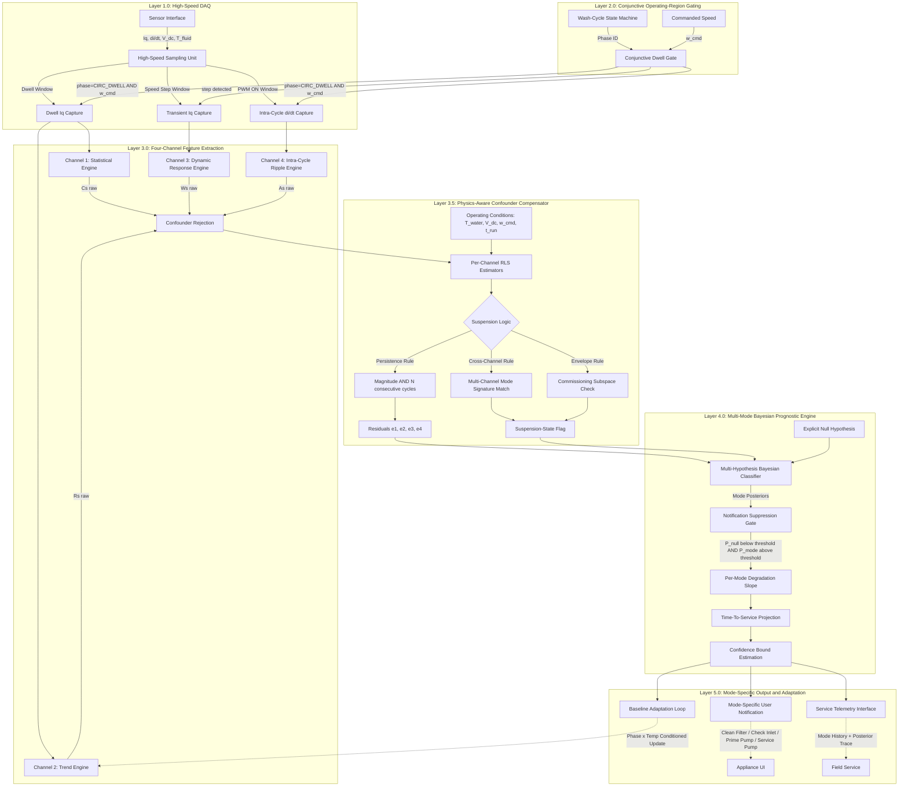

```mermaid
graph TD
    subgraph "Layer 1.0: High-Speed DAQ"
        A[Sensor Interface] -->|Iq, di/dt, V_dc, T_fluid| B[High-Speed Sampling Unit]
        B -->|Dwell Window| B1[Dwell Iq Capture]
        B -->|PWM ON Window| B2[Intra-Cycle di/dt Capture]
        B -->|Speed Step Window| B3[Transient Iq Capture]
    end

    subgraph "Layer 2.0: Conjunctive Operating-Region Gating"
        WSM[Wash-Cycle State Machine] -->|Phase ID| G1
        SPD[Commanded Speed] -->|w_cmd| G1
        G1[Conjunctive Dwell Gate]
        G1 -->|phase=CIRC_DWELL AND w_cmd<w_th| B1
        G1 -->|phase=CIRC_DWELL AND w_cmd<w_th| B2
        G1 -->|step detected| B3
    end

    subgraph "Layer 3.0: Four-Channel Feature Extraction"
        B1 --> C1[Channel 1: Statistical Engine]
        B1 --> C2[Channel 2: Trend Engine]
        B3 --> C3[Channel 3: Dynamic Response Engine]
        B2 --> C4[Channel 4: Intra-Cycle Ripple Engine]
        C1 -->|Cs raw| D[Confounder Rejection]
        C2 -->|Rs raw| D
        C3 -->|Ws raw| D
        C4 -->|As raw| D
    end

    subgraph "Layer 3.5: Physics-Aware Confounder Compensator"
        OC[Operating Conditions: T_water, V_dc, w_cmd, t_run]
        D --> K1[Per-Channel RLS Estimators]
        OC --> K1
        K1 --> SL{Suspension Logic}
        SL -->|Persistence Rule| PR[Magnitude AND N consecutive cycles]
        SL -->|Cross-Channel Rule| CC[Multi-Channel Mode Signature Match]
        SL -->|Envelope Rule| EG[Commissioning Subspace Check]
        PR --> RES[Residuals e1, e2, e3, e4]
        CC --> SF[Suspension-State Flag]
        EG --> SF
    end

    subgraph "Layer 4.0: Multi-Mode Bayesian Prognostic Engine"
        RES --> E1[Multi-Hypothesis Bayesian Classifier]
        SF --> E1
        NULL[Explicit Null Hypothesis] --> E1
        E1 -->|Mode Posteriors| F1[Notification Suppression Gate]
        F1 -->|P_null below threshold AND P_mode above threshold| F2[Per-Mode Degradation Slope]
        F2 --> G2[Time-To-Service Projection]
        G2 --> H1[Confidence Bound Estimation]
    end

    subgraph "Layer 5.0: Mode-Specific Output and Adaptation"
        H1 --> I1[Mode-Specific User Notification]
        H1 --> I2[Service Telemetry Interface]
        I1 -.->|Clean Filter / Check Inlet / Prime Pump / Service Pump| UI[Appliance UI]
        I2 -.->|Mode History + Posterior Trace| TEL[Field Service]
        H1 --> J1[Baseline Adaptation Loop]
        J1 -.->|Phase x Temp Conditioned Update| C2
    end

```
