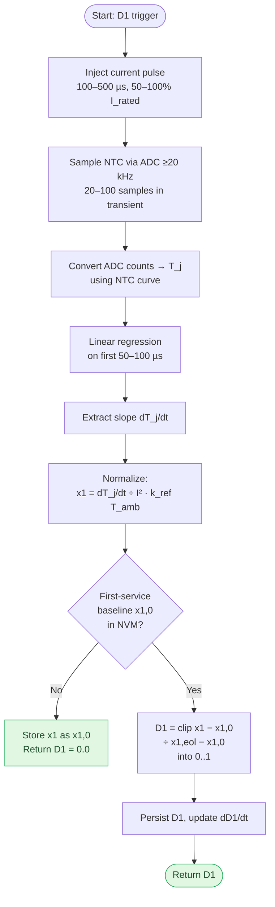
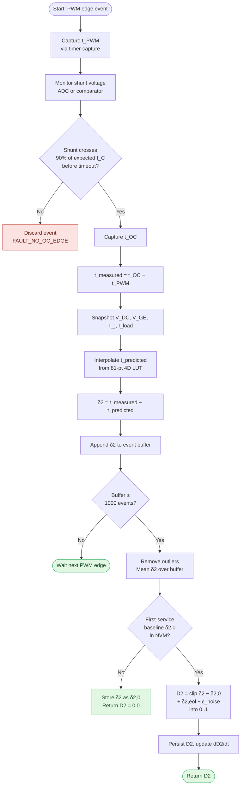
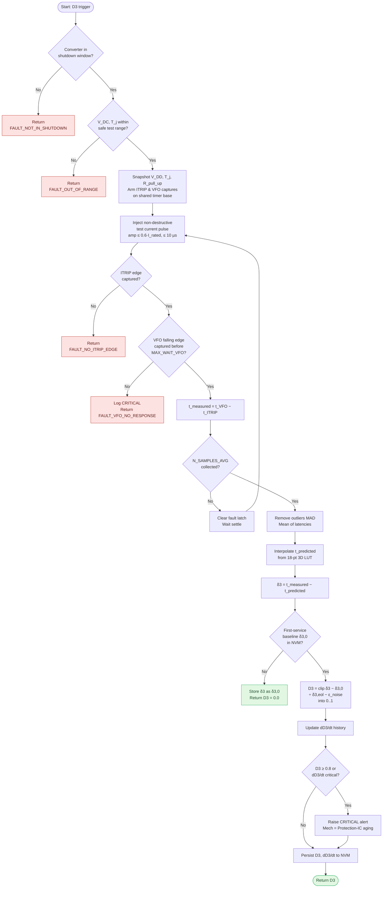

# Measurement Methodology for Each Degradation Parameter

## D₁: Thermal Transient Observer

**What you measure:** Junction temperature slope during current pulse

**Step-by-step:**
1. Inject current pulse (100–500 µs, 50–100% rated current) into IPM power stage
2. Sample NTC thermistor via ADC at ≥20 kHz (capture 20–100 samples in transient window)
3. Convert ADC counts to junction temperature using pre-characterized NTC curve
4. Perform linear regression on first 50–100 µs of temperature rise
5. Extract slope: dT_j/dt [K/s]
6. Divide by I² and temperature-dependent reference function: x₁ = (dT_j/dt) / (I² · k_ref(T_amb))
7. Compute degradation: D₁ = clip((x₁ − x₁,₀) / (x₁,eol − x₁,₀), 0, 1)

**Frequency:** Once per 100 power cycles or once per 10 ms (whichever is less frequent)

**Hardware required:** ADC, timer/counter, NTC input

**Flowchart:**

---

## D₂: Electrical Latency Observer

**What you measure:** PWM-to-overcurrent propagation delay with operating-point compensation

**Step-by-step:**
1. Issue PWM gate command (rising or falling edge)
2. Capture timestamp t_PWM via high-resolution timer
3. Monitor shunt-resistor voltage (via ADC or external comparator)
4. Capture timestamp t_OC when shunt voltage crosses 90% of expected collector current
5. Calculate latency: t_measured = t_OC − t_PWM [ns]
6. Look up baseline from 81-point LUT at current (V_DC, V_GE, T_j, I_load)
7. Interpolate predicted value: t_predicted = LUT(V_DC, V_GE, T_j, I_load)
8. Calculate residual: δ₂ = t_measured − t_predicted
9. Compute degradation: D₂ = clip(|δ₂| / (δ₂,eol − ε_noise), 0, 1)

**Frequency:** Every switching event (at PWM frequency, typically 10–20 kHz); aggregate over 1000 events for noise rejection

**Hardware required:** Timer-capture peripheral (sub-microsecond precision), ADC or comparator for shunt monitoring

**Flowchart:**

---

## D₃: Protection-Logic Latency Observer (Novel)

**What you measure:** ITRIP-to-VFO propagation delay via non-destructive test

**Step-by-step:**
1. Detect shutdown window (converter idle, PWM disabled)
2. Inject deliberate test-current pulse (via PWM modulation or external driver) to trigger overcurrent comparator
3. Monitor shunt voltage; capture timestamp t_ITRIP when voltage crosses ITRIP threshold (0.47–0.50 V)
4. Simultaneously monitor VFO terminal (open-drain output pulled up by external resistor)
5. Capture timestamp t_VFO when VFO transitions from 5V to 0V
6. Calculate latency: t_measured = t_VFO − t_ITRIP [ns]
7. Look up baseline from 18-point LUT at current (V_DD, T_j, R_pull_up)
8. Interpolate predicted value: t_predicted = LUT(V_DD, T_j, R_pull_up)
9. Calculate residual: δ₃ = t_measured − t_predicted
10. Compute degradation: D₃ = clip(|δ₃| / (δ₃,eol − ε_noise), 0, 1)

**Frequency:** Once per hour or once per 1000 power cycles (during shutdown windows only; non-destructive)

**Hardware required:** Timer-capture peripheral (dual-channel for ITRIP and VFO), ADC or comparator, PWM or current-injection capability

**Flowchart:**

---

## Summary: Measurement Comparison

| Parameter | Signal | Frequency | Triggering | Precision | Difficulty |
|-----------|--------|-----------|-----------|-----------|-----------|
| **D₁** | NTC slope | ~100 cycles | Deliberate pulse | ±5% | Easy |
| **D₂** | Switching time | Every event | PWM edge | ±10 ns | Medium |
| **D₃** | Protection latency | Hourly/1k cycles | Test injection | ±50 ns | Hard (novel) |

---

**Key insight:** D₁ and D₂ use deliberate/natural triggering. **D₃ requires non-destructive test-current injection during idle—the innovative enabler.**
