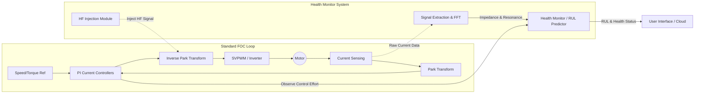

# Invention Disclosure: Multi-Physics RUL Prediction via Sensorless Impedance Spectroscopy

## 1. Title
**System and Method for Sensorless Remaining Useful Life (RUL) Prediction using Inverter-Driven Multi-Physics Health Indicators**

---

## 2. Abstract
This disclosure describes a system for predicting the **Remaining Useful Life (RUL)** of an electric motor by leveraging existing power electronics to perform **In-Situ Impedance Spectroscopy**. The method utilizes the motor’s **Pulse Width Modulation (PWM) inverter** as a high-frequency signal generator, eliminating the need for external diagnostic hardware. By injecting a high-frequency carrier signal into the stator windings, the system extracts a dynamic **Impedance Plot** from existing current sensors. 

The core innovation lies in the fusion of three degradation domains: 
1. **Electrical (Winding resistance and L/R constants)**
2. **Magnetic (Flux linkage and permeability $\mu$)**
3. **Derived Spectral Shifts (Resonance frequency $\Delta f_r$)**

By correlating the horizontal shift and vertical flattening of the impedance resonance peak with **core material aging** and **insulation fatigue**, a Bayesian statistical model generates a probabilistic RUL estimate. This enables appliances to self-diagnose material-level degradation during standard operation.

---

## 3. Technical Field
*   **Primary:** Predictive Maintenance (PdM) / Prognostics and Health Management (PHM)
*   **Secondary:** Variable Frequency Drives (VFD), Magnetic Material Science, Statistical Regression

---

## 4. Problem Statement
Traditional RUL models for appliances are limited by:
*   **Sensor Costs:** Requiring expensive vibration or flux sensors.
*   **Lagging Indicators:** Detecting faults (e.g., shorts) only after irreversible damage occurs.
*   **Material Blindness:** Failing to account for "silent" aging, such as the gradual decay of **magnetic permeability ($\mu$)** in the core or thinning of wire enamel.

---

## 5. The Multi-Physics Solution
The system creates a **Health Index (HI)** using a "Triple-Domain" approach, all extracted via the motor's own control firmware.

### A. The Signal Injection Method (The "Probing" Step)
The inverter modulates the PWM duty cycle to perform a frequency sweep (e.g., 1kHz - 20kHz) at standstill.
*   **Input:** Commanded Voltage Vector ($V^*$).
*   **Output:** Measured Current Response ($I_{meas}$).
*   **Calculation:** $Z(f) = V^*(f) / I_{meas}(f)$.

### B. Multi-Physics Indicators

| Category | Parameter | Physical Indicator of Aging |
| :--- | :--- | :--- |
| **Electrical** | $R_s$, Inductance ($L$) | Ohmic heating and winding shorts. |
| **Magnetic** | Flux Linkage ($\lambda$) | Permanent magnet weakening / Coercivity decay. |
| **Derived** | **Resonance Shift ($\Delta f_r$)** | **Core material aging** (Permeability decay). |
| **Derived** | **Peak Flattening ($Q$)** | **Insulation aging** (Dielectric loss). |

---

## 6. Novelty and Claims
### Key Novelty:
The use of the **resonance frequency peak** as a proxy for the physical state of the magnetic core material. As the core "fatigues," its ability to conduct magnetic flux (permeability) changes, causing the electrical resonance of the entire motor to shift in a mathematically predictable way ($f_r \approx 1/\sqrt{LC}$).

### Specific Claims:
1.  **Claim 1:** A method for extracting a motor impedance spectrum using **PWM carrier injection** to identify shifts in resonance frequency.
2.  **Claim 2:** A statistical model that correlates the **rate of resonance frequency shift ($\Delta f_r / \Delta t$)** with the degradation of magnetic core permeability.
3.  **Claim 3:** A "hardware-free" diagnostic framework that utilizes existing inverter phase-current sensors to calculate a **Multi-Physics Health Index**.

---

## 7. Statistical RUL Calculation
The RUL is estimated using a **Particle Filter** or **Exponential Regression** based on the Health Index (HI):
$$HI(t) = w_1 \cdot \Delta f_r + w_2 \cdot \Delta R + w_3 \cdot \Delta \lambda$$
Where $w_i$ are sensitivity weights. The RUL is defined as the time $t$ remaining until $HI(t)$ reaches a critical failure threshold defined by material safety limits.

## 8. Implementation in Field-Oriented Control (FOC) Systems
The proposed RUL model is uniquely compatible with Vector Motor Drives (FOC) by utilizing the decoupled control of flux and torque:

*   **D-Axis Perturbation:** High-frequency voltage is injected into the d-axis ($V_d$) to measure the **impedance resonance** of the magnetic circuit without impacting torque ripple or mechanical stability.
*   **Real-Time Parameter Estimation:** The FOC current regulators act as a natural filter, allowing the system to extract winding resistance and inductance changes as "model errors" during standard operation.
*   **Sensorless Symmetry:** Because FOC already requires high-resolution phase current sensing and rotor position estimation, no additional hardware is required to capture the **$\Delta f_r$ shift**.

## 9 Block Diagram and System Architecture


### 10. Embedded Implementation: Parameter Tracking
To ensure robust RUL prediction, a **Recursive Linear Kalman Filter** is implemented to track the state of Inductance ($L$). The filter utilizes a process noise covariance ($Q$) tuned to the expected material degradation rate and a measurement noise covariance ($R$) tuned to the inverter's current-sensing resolution. This ensures that transient noise from PWM switching does not trigger false RUL alerts.

### 11. C Template

```
#include <stdio.h>

/**
 * Kalman Filter Structure for Inductance Tracking
 */
typedef struct {
    float L_estimate;    // The current estimate of Inductance (The State)
    float P;             // Estimation error covariance
    float Q;             // Process noise covariance (How much L fluctuates naturally)
    float R;             // Measurement noise covariance (Sensor/PWM noise)
    float K;             // Kalman Gain
} InductanceKF;

/**
 * Initialize the Filter
 * @param initial_L: The factory baseline inductance (e.g., 0.015 Henrys)
 */
void KF_Init(InductanceKF *kf, float initial_L) {
    kf->L_estimate = initial_L;
    kf->P = 0.1f;    // Initial uncertainty
    kf->Q = 0.0001f; // Trust the model (L changes very slowly over months)
    kf->R = 0.01f;   // Measurement noise (Trust the sensor data less than the model)
}

/**
 * Update the Inductance Estimate
 * @param measured_L: The L calculated from the current shift/impedance plot
 * @return The filtered inductance estimate
 */
float KF_Update(InductanceKF *kf, float measured_L) {
    // --- 1. PREDICT Step ---
    // Since Inductance is a constant/slow-changing state, L_pred = L_last
    // kf->L_estimate = kf->L_estimate; 
    kf->P = kf->P + kf->Q;

    // --- 2. MEASUREMENT UPDATE (Correction) Step ---
    // Calculate Kalman Gain: K = P / (P + R)
    kf->K = kf->P / (kf->P + kf->R);

    // Update the State Estimate: L = L + K * (measured - L)
    kf->L_estimate = kf->L_estimate + kf->K * (measured_L - kf->L_estimate);

    // Update Error Covariance: P = (1 - K) * P
    kf->P = (1.0f - kf->K) * kf->P;

    return kf->L_estimate;
}

// Example Usage
int main() {
    InductanceKF myTracker;
    KF_Init(&myTracker, 0.015f); // 15mH Baseline

    // Simulated noisy measurements from the Impedance Plot
    float noisy_measurements[] = {0.0148, 0.0152, 0.0145, 0.0149, 0.0147};

    for(int i = 0; i < 5; i++) {
        float filtered_L = KF_Update(&myTracker, noisy_measurements[i]);
        printf("Measured: %.4f | Filtered L: %.4f\n", noisy_measurements[i], filtered_L);
    }

    return 0;
}

```