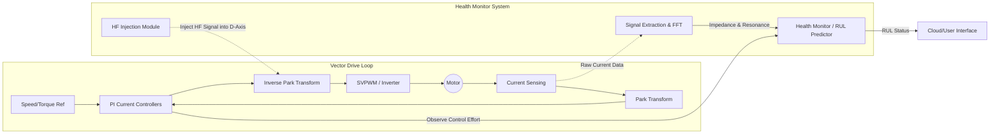

# Invention Disclosure: Multi-Physics RUL Prediction via Sensorless Impedance Spectroscopy

## 1. Title
**System and Method for Sensorless Remaining Useful Life (RUL) Prediction using Inverter-Driven Multi-Physics Health Indicators**

---

## 2. Abstract
This disclosure describes a system for predicting the **Remaining Useful Life (RUL)** of an electric motor by leveraging existing power electronics to perform **In-Situ Impedance Spectroscopy**. The method utilizes the motor’s **Pulse Width Modulation (PWM) inverter** as a high-frequency signal generator, eliminating the need for external diagnostic hardware. By injecting a high-frequency carrier signal into the stator windings, the system extracts a dynamic **Impedance Plot** from existing current sensors.

The core innovation lies in the fusion of three degradation domains:
1. **Electrical (Winding resistance and L/R constants)**
2. **Magnetic (Flux linkage and permeability $\mu$)**
3. **Derived Spectral Shifts (Resonance frequency $\Delta f_r$)**

By correlating the horizontal shift and vertical flattening of the impedance resonance peak with **core material aging** and **insulation fatigue**, a Bayesian statistical model generates a probabilistic RUL estimate. This enables appliances to self-diagnose material-level degradation during standard operation.

---

## 3. Technical Field
*   **Primary:** Predictive Maintenance (PdM) / Prognostics and Health Management (PHM)
*   **Secondary:** Variable Frequency Drives (VFD), Magnetic Material Science, Statistical Regression

---

## 4. Problem Statement
Current motor health monitoring is limited by high sensor costs and "lagging" indicators. Existing solutions often detect faults only after irreversible damage occurs (e.g., thermal runaway). There is a critical need for a **"Hardware-Free"** method to detect **Sub-Threshold Degradation**, specifically:
*   Irreversible **magnetic core fatigue** (permeability decay).
*   **Insulation thinning** that occurs before a catastrophic short circuit.

---

## 5. System Architecture & Block Diagram
The system is integrated into a **Field-Oriented Control (FOC)** framework. A "Health Monitor" block acts as a supervisory layer, interfacing between the PI Current Controllers and the SVPWM Module.

---

## 6. Implementation Logic
### Phase 1: Baseline Fingerprinting
Perform a wide-band frequency sweep (1 kHz – 20 kHz) at commissioning to store the "Golden Baseline" resonance peak ($f_{r0}$) in non-volatile memory.

### Phase 2: Signal Injection (Sensorless Probing)
Utilize **D-Axis PWM Dithering** to inject high-frequency voltage carriers. This method is "acoustically transparent" as it does not produce torque ripple.
$$Z(f) = \frac{V_{injected}(f)}{I_{measured}(f)}$$

### Phase 3: Recursive Bayesian Tracking (Embedded C)
A **Linear Kalman Filter** tracks the state of Inductance ($L$) and Resistance ($R$) over time, smoothing sensor noise.
*   **Inductance Shift:** A right-shift in $f_r$ indicates core permeability ($\mu$) decay.
*   **Peak Flattening:** A decrease in the Quality Factor ($Q$) indicates insulation dielectric loss.

### Phase 4: RUL Forecasting
A Bayesian regression projects the current **Health Index (HI)** toward a critical threshold ($HI_{crit}$):
$$HI(t) = w_1 \cdot \Delta f_r + w_2 \cdot \Delta R + w_3 \cdot \Delta \lambda$$
$$RUL = t(HI_{crit}) - t_{now}$$

---

## 7. Comparison to Prior Art

| Feature | Conventional Systems | Proposed Invention |
| :--- | :--- | :--- |
| **Primary Data** | Vibration / Temperature | **Impedance Resonance ($\Delta f_r$)** |
| **Hardware** | External Accelerometers | **Sensorless (Firmware-only)** |
| **Focus** | Fault Detection (Bearings) | **Material Aging (Core/Insulation)** |
| **Strategy** | Reactive / Time-based | **Prognostic / Bayesian-based** |

---

## 8. Novelty & Claims
1.  **Claim 1:** A method for determining motor health by correlating the **horizontal shift of the impedance resonance peak** with magnetic permeability decay.
2.  **Claim 2:** The use of a **Vector Drive's d-axis** to perform non-intrusive high-frequency diagnostic sweeps.
3.  **Claim 3:** A "Cradle-to-Grave" RUL model that utilizes **recursive Bayesian estimation** on an embedded microcontroller without additional sensing hardware.

---

## 9. Conclusion
This invention provides a high-fidelity diagnostic feature with **zero incremental hardware cost**. By shifting from reactive fault detection to material-level prognostics, manufacturers can reduce warranty costs, improve safety, and offer "Health-as-a-Service" for consumer and industrial appliances.
