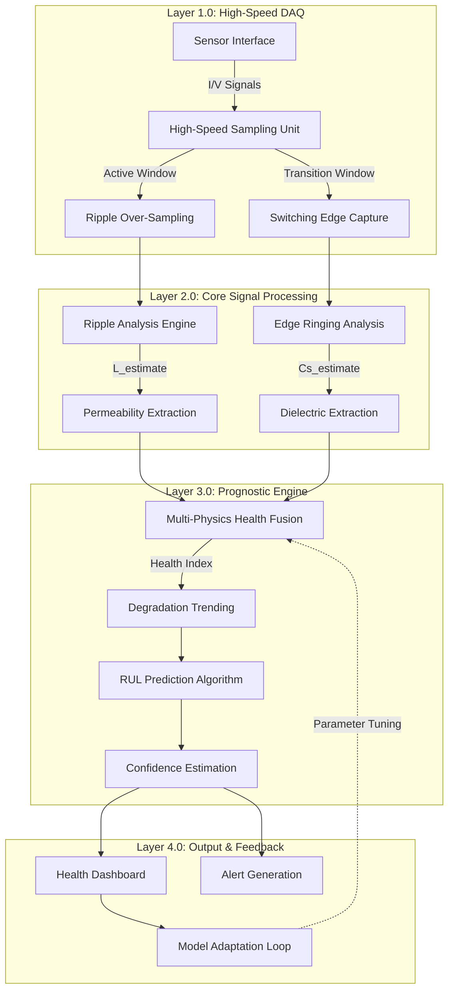

```mermaid
graph TD
    subgraph "Layer 1.0: High-Speed DAQ"
        A[Sensor Interface] -->|I/V Signals| B[High-Speed Sampling Unit]
        B -->|Active Window| B1[Ripple Over-Sampling]
        B -->|Transition Window| B2[Switching Edge Capture]
    end

    subgraph "Layer 2.0: Core Signal Processing"
        B1 --> C1[Ripple Analysis Engine]
        B2 --> C2[Edge Ringing Analysis]
        C1 -->|L_estimate| D1[Permeability Extraction]
        C2 -->|Cs_estimate| D2[Dielectric Extraction]
    end

    subgraph "Layer 3.0: Prognostic Engine"
        D1 --> E1[Multi-Physics Health Fusion]
        D2 --> E1
        E1 -->|Health Index| F1[Degradation Trending]
        F1 --> G1[RUL Prediction Algorithm]
        G1 --> H1[Confidence Estimation]
    end

    subgraph "Layer 4.0: Output & Feedback"
        H1 --> I1[Health Dashboard]
        H1 --> I2[Alert Generation]
        I1 --> J1[Model Adaptation Loop]
        J1 -.->|Parameter Tuning| E1
    end

```
